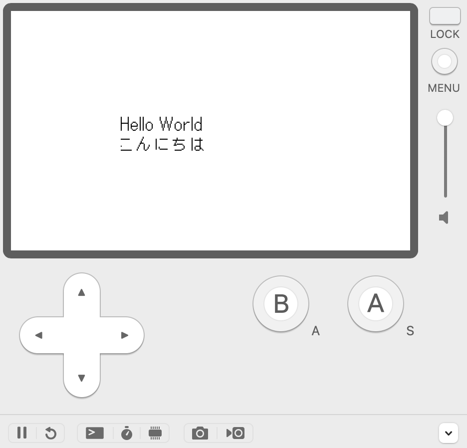

# Playdate Template

A template for developing games on [Playdate](https://play.date/). It can be used to quickly start a game project development.




This template depends on [LuaLS/lua-language-server](https://github.com/LuaLS/lua-language-server).

so theoretically, if your editor supports `LSP` for `Lua`, you can enjoy type inference during development.


**Please note: This template has been tested only on MacOS.**

## How to use

1. Use this template
2. And you can try to run `scripts/build_and_run.sh`

If you don't have `$PLAYDATE_SDK_PATH` in your environment variable, I strongly recommend you to set one.

```sh
export PLAYDATE_SDK_PATH="$(dirname $(readlink $(which pdc)))"
```

## How to play this template

Yeah, you can play this template! Something interesting?

- Up/Down/Left/Right: Move text
- Rotate Crank: Rotate text

## Prerequisites

- [Playdate SDK](https://sdk.play.date/)
